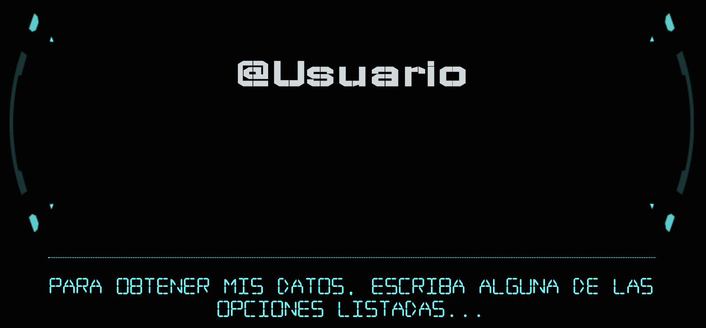

# myp-terminal

Guía interactiva sobre Git

## ScreenShoot

Mi portfolio emulador de terminal con CSS3

Portfolio que simula una Terminal con comandos de consola, stylus y jquery, la propuesta es hacer una versión de portfolio que en vez de presionar opciones para visualizar contenido, escribes los comandos y se visualiza la información en un monitor futurista con texto plano y efecto mecanográfico :-)

En el proyecto se ha utilizado stylus para procesar los estilos.

Si te gusta la idea inicial, te animo a mejorarla, suma tu propuesta al proyecto.

Se acepta todo tipo de pull request, nuestra intención de base sobre este repositorio es el entrenamiento y uso de buenas prácticas con Git y GitHub.

[demo](https://estebanrfp.github.io/myp-terminal)

Esteban Fuster Pozzi / @estebanrfp
Slvr / @slvrkl
Agustín Palmieri / @aguja2013

Visite nuestro portal de tecnologías para la web:

[desarrolloactivo.com](https://desarrolloactivo.com)
